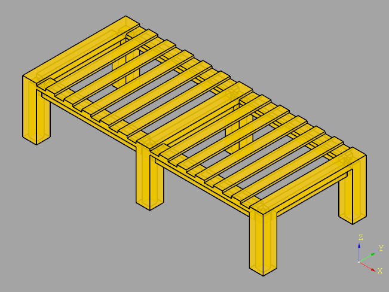

# !!! under construction !!!

# Student-Bed

# Preamble

Why does this repository exist? My son has declared some demand for an additional bed for his student digs. I have got an order to run a project. That's clear, I take this challenge. This is a perfect candidate to learn Python, Cadquery and some aspects of Woodworking. The entire project is organized as a sequence of mile-stones. After each mile-stone I will add an entry in this Readme.md. Stay curious, I will take you along for a longer, and hopeful, interesting journey. Let us start, the adventure begins ...

# Mile-Stone #1: Model Specification

Before a journey starts, it is always good to know, which destination we want to reach. A clear view of the goal is always helpful. In our case this is a bed, and this bed needs a specification. It comes in two flavors.

The External-Model-Specification, for short EMS, describes the requirements from the view of the customer (my son). Here, he describes what he wants to get. The most important topics are related to measures. All these details can be found in [EMS](docs/EMS.txt). 
 
The Internal-Model-Specification, for short IMS, covers the aspects of the design and implementation. It holds all the details from the view of a cabinetmaker (that's my role). This document can be found here [IMS](docs/IMS.txt).

# Mile-Stone #2: Software-Tools 

This project requires some resources for its execution. Some tools are need for the design of the bed, and some others for the wood-working. This project is designed as a tutorial, we try to use the up-to-date tools. Before we do any woodworking, we create a CAD-model first, then we are able to see how it will look like. The tool for this purpose is "CadQuery", a CAD-library written in Python. 

The hidden agenda is to give some stimulus to learn new tools, this applies for us both, for my son and me. Normally 3D-models are drawn by a CAD-Tool. Such tools are powerful, but they require some kind of training. With this project we go in another direction, instead of drawing lines and faces, the 3D-model is programmed, that means we have to write a python-program. This strategy has some advantages, the python-program is very compact and easy to maintain. Changing measures are only a few clicks away.

How does this work? How to convert a python-program to a visual 3D-object? This is the task of a 3D-viewer (renderer), in our case this done by CQ-editor. "CadQuery" and "CQ-Editor" are close companions. In most cases they are used together. As the naming might indicate, the "CQ-editor" can do more than visualizing the model, it has also some capabilities to adapt the python-code. It is a small IDE (Integrated Development Environment). For our purposes this IDE is fully sufficient.
 
As always, a running project is never a straight forward going. It is more an evaluation of various alternatives. Going back and forth is quite normal. What might be the best solution, that will crystallize out later during our journey. Because of that it makes a lot of sense to have good revision-control-system, which can store all intermediate revisions. The top-candidate for this purpose is "git".

And because now-a-days everything can go to a cloud, we establish the infrastructure for this, too. Here we choose GitHub, a platform where you can host your public projects for free. Git and GitHub are also close companions. All code for this project is kept in a folder on the local machine. With some git-commands this folder can be transfered to GitHub and vice versa. In the name-space of GitHub this folder is called a "repository".

There is one thing left over. What kind of editor we will use, for modifying our source-files? We could do this with CQ-Editor, but for this scenario we choose VS-Code. At first glance it looks like an another editor. That's true, but it has many benefits (will become clearer soon).
 
So far, the tool-box for the software-side is almost complete. What is needed for wood-working will be discussed later.

# Mile-Stone #3: Risks with Software Installations

On the windows-platform performing installations is coupled with some risks.

Such a task can be accomplished in a few minutes, if you have good and proven recipe (good luck). If you don't have one, calculate more time, it can consume hours, days, weeks or even more (bad luck).

The standard procedure is:
* go to the web-page of the application
* download the package for your platform (in our case windows)
* read the install-instructions
* run the installer by double-clicking
* answer the questions that the installer might ask

If you fetch the application from an app-store, these steps may run unter the hood. This looks feasible. Normally the installation-instructions are described from the perspective of a blank windows and me-alone-application. But this is an unusual case!

Scenario 1: blank windows + me alone + defaults only (no risk)

This is easy doing. Do not expect any problems.

Scenario 2: blank windows + me alone + defaults changed (low to medium risk)

The installer might ask several questions. Sometimes it is difficult to give initially the right answer, because it is not clear what kind of consequences are associated with your choice. Good written applications offer later on the possibility to adjust these parameters. But most applications give you only a single chance, as long as the installer runs. In this case the installation has to be re-run, by calling first the de-installer. In most cases the de-installer does only remove app-code, but not the associated settings. If you try to re-run the app again, very often you see the same trouble as before. You have to consult "stackoverflow" to see whether there is a solution available. The settings can be scattered all over the world. Try to inspect the dot-files inside your home-directory, your AppData-tree, and sometimes the registry needs special care. At any case to get rid of old settings is a challenge for its own.

Scenario 3: updated windows + old-me (low to medium risk)

A lot of applications have a built-in updater. Try to use it as first choice. Your settings will be preserved and only the code gets updated. This has low risk. If you have to de-install first, then the risk will rise up to medium level.

Scenario 4: updated windows + many other apps + me (high risk)

Typically an application does not only depend on windows, but on some other applications. And each application can request specific revisions of other applications. This is really a difficult scenario, which means the applications have to be installed in the right sequence. And sometimes the applications request contradictory revisions.

Scenario 5: broken installation (highest risk)

An installation should always be an all-or-nothing operation, which means an application should succeed or leave the computer untouched. On the windows-platform installations are something in between. This situation can be reached easily, if the installer fails. In this case the application is in a corrupted state. It is like a zombie. You can only recover by applying steamroller tactics which means installing windows from scratch, waiting for days until all window-upates are applied, and installing all other applications again!

To make this long story short: Make sure you have a backup of at least your user-data, or even better, create an image-backup first to preserve your working environment!

# Mile-Stone #4: Software Installation

Our installations belong to scenario 4, which means we are walking in the high risk area.

The following procedure describes the needed steps, assuming that these applications are currently not installed on your computer. If some are already present, you can skip individual steps. But be aware you are entering an unexplored area which may show up new surprises.

Make sure that your windows is up-to-date (windows-update).

We install "git" first. Follow the instructions given [here](docs/HowTo-Git.txt). The video there, is highly recommeded. Don't forget to specify "user.name" and "user.email" at the end of the procedure. Without that "git" will reject to perfom any work for you. If it succeeds, you will have a Git-Bash on your desktop. With this you can open a Command-Shell. It looks similiar like a CMD-window, but is offers much more capabilities. You get full access to "git" and some famous linux tools like "find" and "grep". Always use the Git-Bash, if you plan to talk to "git" from the command-line level. Other Command-Windows like CMD or Power-Shell do not have the right context. Keep that in mind.

Next we take care for GitHub. GitHub promotes "GitHub Desktop". It is not really needed for our initial steps. Do not install it at this point. To use GitHub, you don't need any installations, you need just an account. Perform the steps listed [here](docs/HowTo-GitHub.txt). Then define your first "repository" which consists initially of 3 files: a "Readme.md", "LICENSE" and a ".gitignore". For ".gitignore" select the template for python. The "LICENSE" is up to you. There is one subtlety here: "git" had asked you to specify your email-address and "GitHub" has asked you for a login-name which is likewise also an email-address. Both work only work smoothly together, if the email-address is same for both.

The next application is Visual Studio Code, often simply called VS-Code. Originally it has been designed as an editor. But in the meantime it has reached the level of a comfortable IDE (integrated develop environment). VS-Code has extensions for almost everything. For Python and many other programming languages. Besides this, it offers built-in git-support. By using VS-Code you can do all needed git-tasks thru the graphical interface which is really simple to use. Some more details are given [here](docs/HowTo-VSCode.txt)

The welcome-screen, which pops up during first start-up, recommends some other things to activate. Be reserved and resist the temptation to activate more. If I remember correctly, there was one flag related to git, which I have activated.

You should only install the following extensions for the very beginning:

* Your language Pack
* Git Graph
* Python (by Microsoft)

Now we have reached a stage where we can consider to install CadQuery and CQ-editor, see [here](docs/HowTo-CadQuery.txt) to grasp all the details. And as always, goto the web-page and learn how to install. After you have read the Readme.md, you are overwhelmed by such a variety of choices. And what does fit for my machine? The first answer is, it depends: great! You have come in touch with new tools never heard before. Some phobia came up my head, because this looks like additional work. There will be more effort needed to get the new serpents, called "conda" and "mamba", under control. They don't have an own home, they reside together in a common refugium called [miniforge](https://github.com/conda-forge/miniforge).

It will take awhile to find out how the things work in this area. You know already, all this stuff belongs somehow to python-installations. A lot of strange things at first glance. The goal is to find a running combination of Python, CadQuery and CQ-Editor. All 3 depend on other packages, and each of them can have additional dependencies. Python has a package-manager called "pip". Why is "pip" not sufficient? And then you remember why some installations are associated with high risks (scenario 4). Because they might have contradictory requirements. Could "conda" and "mamba" be a solution for this problem? We will see it soon. In this context a new term, named "virtual environment", appears on the scene. Unfortunately there exist several flavors of "virtual environments" and which is the right one for my project? Questions over questions. There is no other way as to learn these tools. Thanks to the internet you get access to this information immediately, but it takes time to learn. So, my first model, created by CadQuery, has to wait.

And it would make sense to check how big is already the chaos on my computer? How many different versions of python can I find? A double-click on a python-script opens Thonny. Luckily Thonny comes with a built-in version of python and any pips remain in the conext of Thonny. This is good so far. But I can do "python --version" in various Command-Windows. Some do not see Python at all, some others show older versions. Not so nice! Then I found an old Anaconda installation, which I have removed by calling its de-installer. Thonny, I want to keep. I hope the field is cleared enough and ready for CadQuery.

To make it clear:
* pip is a package-manager only
* conda is a combination of environment-manager and package-manager
* mamba is simply a faster conda

The environment-manager creates the needed virtual-environment. This is some kind of a sand-box for your application and the needed dependencies.

The contours got shaped, the picture is clear enough to start. This means I will continue with "mamba".

Let us try to install mamba. All details are given [here](docs/HowTo-Mamba.txt)

After this little detour we return back to the installation of [CadQuery](docs/HowTo-CadQuery.txt). The installation is more or less a one-liner!

Now it is time for a longer coffee-break!

# Mile-Stone #5: Say Hello

Whenever a new environment has been set up, it is good practice to check, whether all tools are callable. For this purpose we say [hello to python](docs/hello-python.py). This is just an one-liner, a simple print-statement. We try this first on VS-Code. Make sure that the python-extension has been activated, then run the program. In the lower panel there is a tab, named Terminal, where you can find "Hello, Python" among some other text. Now we do the same thing with CQ-Editor. The one-liner appears in the Editior-Panel, but pressing the run-icon does not show any reaction, the console-panel at the bottom remains empty. This is unexpected behavior. Reading again the Readme.md of CQ-Editor reveals the output does not go to the console-panel, but it appears on the shell-window, from where the cq-editor has been started. Not very comfortable, but there is offered a better alternative named log().

Now we say [hello-to-cadquery](docs/hello-cadquery.py). With VS-Code the python-program runs without any complaints, but there is no graphical output. This is expected behavior, because nothing is built in the code to show graphics. Now we try the same thing with CQ-Editor. And oh wonder the model appears on the right upper corner. The CQ-Editor can show models without any lines of code. This is great.

But then why writing a section in the Readme.md which explains how to create graphical output, if it works without? There you can learn, only 2 functions are in charge with graphical output:

* show_object()
* debug()

Uncomment lines #6 to #9 and see what happens. The top-face is colored red, and logger-output appears in the Log-Viewer in the lower-bottom corner. Both functions are only needed, if the graphical output has to be customized in some way. Now we make the cross-check on VS-Code and we see some dark clouds at the horizon, because it reports several errors. VS-Code does not know show_result(), debug() and log().

# Mile-Stone #6: Template for Both

Some stubs are created, so that the python-script can be run without any errors on both editors. The template is given [here](docs/template.py)

# Mile-Stone #7: Recommended Workflow

There are many variants possible. The sequence below is easy to use for newbies.

1) create a repository on GitHub
2) clone it to your local machine
3) take the template from the docs-directory as a skeleton to start with
4) activate environment via mamba
5) start VS-Code & load your folder
6) start CQ-Editor and load your python-program
7) edit & modify your program, SQ-Editor will draw the model after every change
8) commit your changes to git, and optionally to GitHub
9) repeat steps 7 to 8 
10) close CQ-Editor
11) close VS-Code
12) deactivate environment via mamba

If the repository is created first on GitHub, this has the advantage that the relationship between "remote" and "local" is established from the very beginning.

Some addition hints to "git". The git-database, which holds all your revisions, is stored in a hidden folder named ".git" and it is stored in your project-directory. Never touch this folder and its contents, it would lead to a corrupt database, and all your version can disappear. Having ".git" directly under your project-directory implies that when the project-folder is moved, all revisions go along automatically. There is another dot-file, named ".gitignore". It controls which files and sub-folders are put into ".git". Files and sub-folders excluded here, remain untouched by git, they are untracked. These files and folders can resides anywhere in your project-tree. They remain untouched. They will never appear on GitHub. Keep in mind, "git" has been designed for processing text-files, not for binaries. Binaries can be added, but they consume a lot of space. For each change a copy of the binary is added. Because of that do not store large binary files (BLOBs). The repository will grow quickly and uploads & downloads will take very long.

Steps 7 & 8 need some more explanation. "edit" and "save" are clear. Revision-handling with git is a 3-step-approach: 
* add a file, after saving, to the stage-area. A file there is marked with "A".
* make a commit, the contents of the stage-area goes to the ".git"-folder
* press synchronize, this works in both directions, after that the local changes appear on GitHub.

The CQ-Editor is primarily used as a model-viewer. In the View-menu turn off all unwanted panels, except "Log viewer" and "Current traceback". And in the Preference-Section enable "autoreload". This flag is required, otherwise an automated model-refresh does not take place, if the model has been changed with VS-Code.

# Mile-Stone #8: Let the Model grow

The design is kept simple. The duckboard is split into 2 halves (not visible at the moment). In total we need only 4 different parts:
* jambs 
* stringers
* ledgers
* battens

[parts](docs/parts.png)

A jamb has a hollow body. The ribs can be plugged into the slots of the jamb.

[jamb](docs/jamb.png)
[rib](docs/rib.png)

The frame is built with 6 jambs and 7 ribs.

[frame](docs/frame.png)

The duckboard covers only one half the bed. The battens are simply loaded on top of the stringers and ledgers.

[stringer](docs/stringer.png)
[ledger](docs/ledger.png)
[duckboard](docs/duckboard.png)

Both duckboards are loaded on top of the frame and the bed is ready. Mission complete, at least what is related to the design.

[bed](docs/bed.png)
