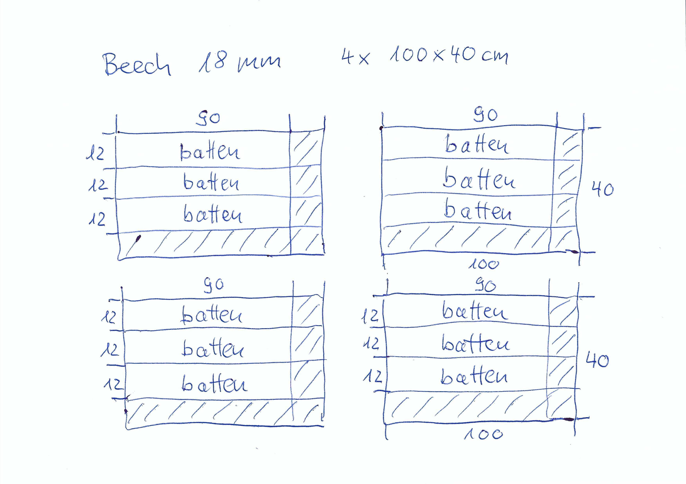
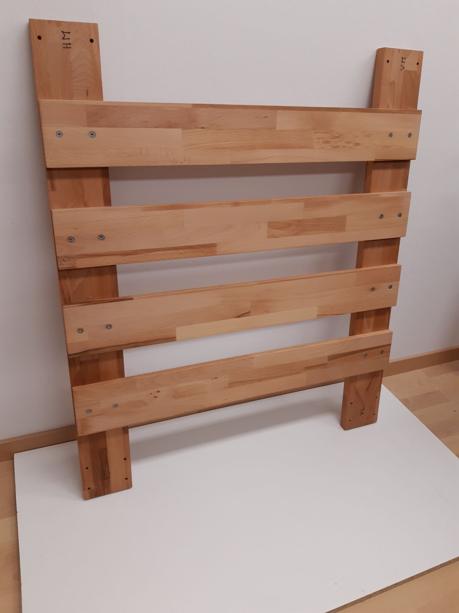

Internal Model Specification

This document describes how the bed is built up. 

The main focus here is how the wooden parts are made and how they are joined together. For the frame the notches serve for this purpose. Jambs and ribs can be simply plugged into each other. For the duckboard it looks different, here the junctions are made with screws. The duckboard consists of two halves. They have to be connected with each other and both with the frame. In the corners the duckboard is bolted with 4 screws. In the middle the duckboard is only bolted with 2 screws. So, the jamb in the middle, with its 4 inserts, is shared by both duckboards and the batten on top belongs to both duckboards. This gives a stable connection and the optical appearance is pleasing.

The bed has to be demountable and because of this woodscrews would be a poor choice, it is much better to use screws with metrical threads. The screws need a metallic counterpart as a nut. But normal nuts would also not be a good choice, better to use inserts, they will remain all the time in the wood, they cannot get lost.

Now, let us go back to the wooden parts. We need pre-cut-plans for all oft them. The dimensions are listed in the [bom](bom.csv).
 
Some wooden parts deviate from the plastic-version of the prototyp. There the jambs are a single box which is shelled out. The wooden-version consists of 2 broad and 2 small sides which are glued together later on. This is mentioned, because the pre-cut-plans show parts which cannot be found in the model.

In our do-it-yourself-stores glued beech wood is offered with thickness of 18mm and 27mm. The format for 18mm is 200cm x 40cm and for 27mm the format is 260cm x 63.5cm. These plates are taken as raw material. The following pre-cut-plans show how the individual parts are cut-out.

The next step is to make cut-outs of the jamb-plates. This is done with the help of two 2D-drawings:

The inner rectangle shows the nominal size of the plate. The outer rectangle is 10mm larger on all sides. This helps to mount the plate for the router. The cut-out-area, also a rectangle, is extended by 5mm on the left side. This needed to get a straight line, otherwise the milling-cutter (6mm) would make a fillet.

The jamb, if glued together, looks quite well.

The drilling of the holes for the inserts is not trivial. They have to be positioned very exactly and the holes have to be perpendicular. The size of the jamb is too large for a standard drilling-machine. There was no other choice as to try a free hand drilling. And, that this will be successful, I made a jig for this purpose. The 2D-drawing for the jig can be seen below.

And the wooden version looks this way.

The jig is simply put on the top of the jamb, but upside down. Then the drill-bit has enough leading and hole is really perpendicular.

The holes for the remaining parts are uncritical, the are drilled on a drill press.

And as always, some not planed problems occur. Two of the stringers had ugly knotholes.

After the repair it looks much better.

Just for completeness all other wooden parts are listed below.

And our final result, everything mounted together, looks fine.

Mission complete!